# 📊 Student Pocket Money Management — Exploratory Data Analysis

**Dataset:** Google Form Responses — **107 respondents**, **29 features**  
**Tools:** Python · Pandas · NumPy · Matplotlib · Seaborn  
**Notebook:** `main.ipynb`

---

## 📁 Project Structure

```
├── main.ipynb                                          # EDA notebook
├── A Study on Pocket Money Management among Students (Responses).xlsx   # Raw dataset
└── output_eda/                                         # All generated plots
    ├── 01_demographics.png
    ├── 02_pocket_money_amount.png
    ├── 03_spending_behaviour.png
    ├── 04_tracking_runout.png
    ├── 05_savings_behaviour.png
    ├── 06_influence_factors.png
    ├── 07_financial_literacy.png
    ├── 08_peer_pressure_tools.png
    ├── 09_correlation_heatmap.png
    ├── 10_cross_analysis_savings.png
    └── 11_dashboard.png
```

---

## 🗂️ Dataset Overview

| Attribute | Value |
|-----------|-------|
| Respondents | 107 |
| Features | 29 |
| Duplicates | 0 |
| Missing values | Ranking columns only (71 NaN — optional question) |

**Columns include:** Demographics (age, gender, family type, stream), pocket money amount & frequency, spending areas, savings behaviour, expense tracking, peer pressure, financial literacy rating, and sources of financial knowledge.

---

## 📊 Analysis Results

### 1️⃣ Demographics

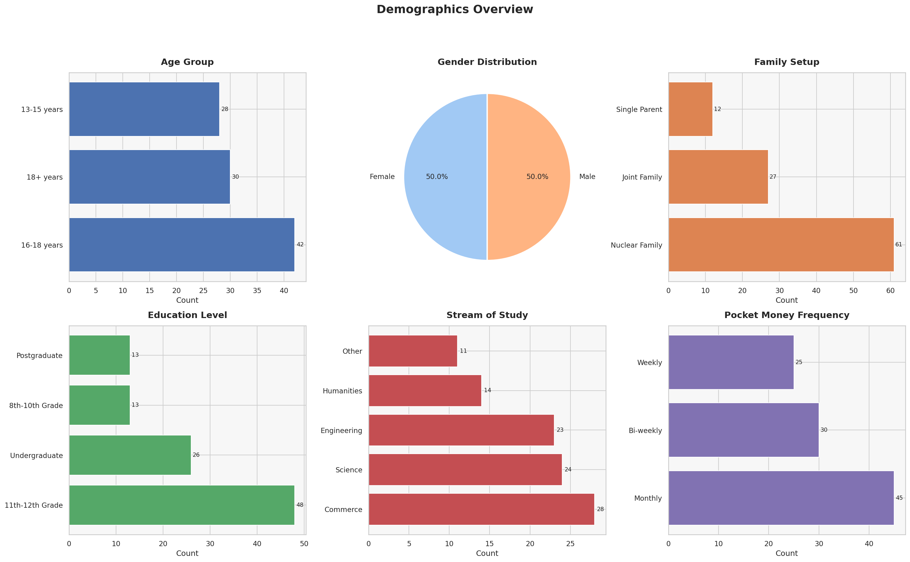

| Variable | Top Category | Count |
|----------|-------------|-------|
| Age Group | 18–20 | 72 / 107 |
| Gender | Male | 54 (Male) / 52 (Female) — near-equal |
| Family Type | Nuclear Family | 77 / 107 |
| Education Level | Undergraduate (UG) | 92 / 107 |
| Stream | Commerce | 67 / 107 |

**Key Insight:** The sample is dominated by young undergraduates (18–20 yrs) from nuclear families studying Commerce — a highly targeted profile for pocket money research.

---

### 2️⃣ Pocket Money Amount Distribution

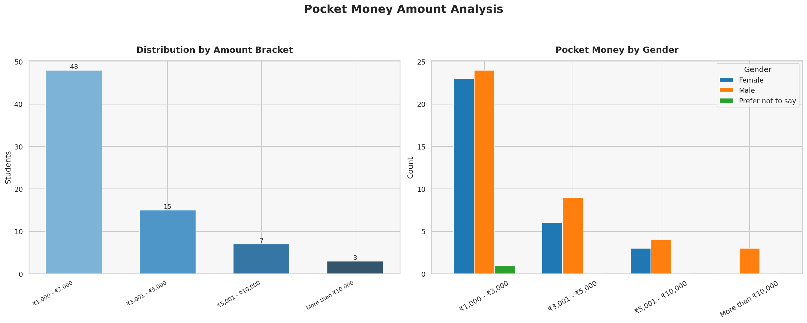

| Amount Range | Students |
|-------------|---------|
| ₹1,000 – ₹3,000 | 48 (45%) |
| Below ₹1,000 | 34 (32%) |
| ₹3,001 – ₹5,000 | 15 (14%) |
| ₹5,001 – ₹10,000 | 7 (6.5%) |
| More than ₹10,000 | 3 (2.8%) |

**Pocket Money Frequency:** Monthly — 42 · Weekly — 25 · Occasionally — 27 · Daily — 12

**Key Insight:** ~77% of students receive ₹3,000 or less per month, indicating limited disposable income in the sample.

---

### 3️⃣ Spending Behaviour

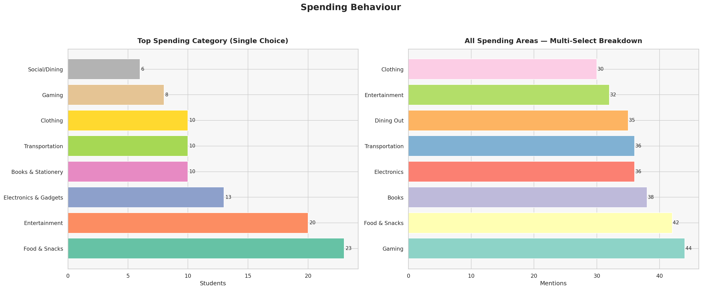

**Top spending areas:** Food & Snacks · Entertainment · Transportation · Shopping  
**Primary spending categories** vary across students; food/beverages is the most commonly cited top category.

**Key Insight:** Day-to-day necessities like food and transport dominate spending rather than discretionary categories like gadgets or clothing.

---

### 4️⃣ Expense Tracking & Run-Out Frequency

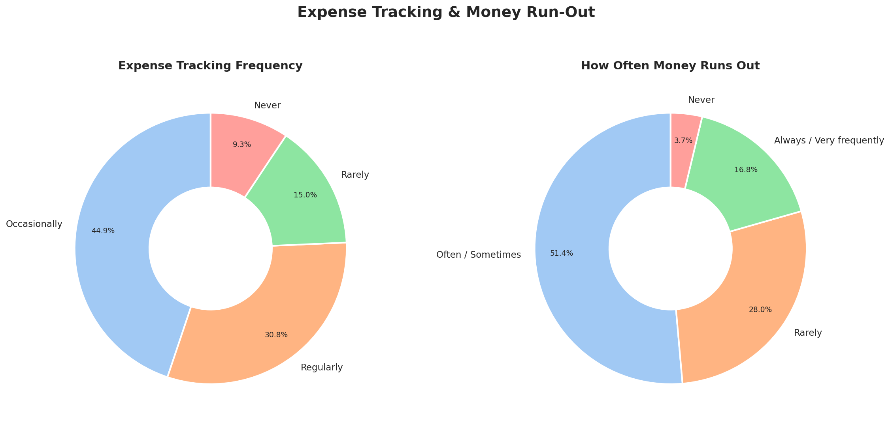

| Expense Tracking | Count |
|-----------------|-------|
| Occasionally | 48 (45%) |
| Regularly | 33 (31%) |
| Rarely | 16 (15%) |
| Never | 10 (9%) |

| Run Out of Money | Count |
|-----------------|-------|
| Often / Sometimes | 55 (51%) |
| Rarely | 30 (28%) |
| Always / Very frequently | 18 (17%) |
| Never | 4 (4%) |

**Key Insight:** Only 31% track expenses regularly, yet 68% run out of money often or sometimes — suggesting a direct link between poor tracking and money shortage.

---

### 5️⃣ Savings Behaviour

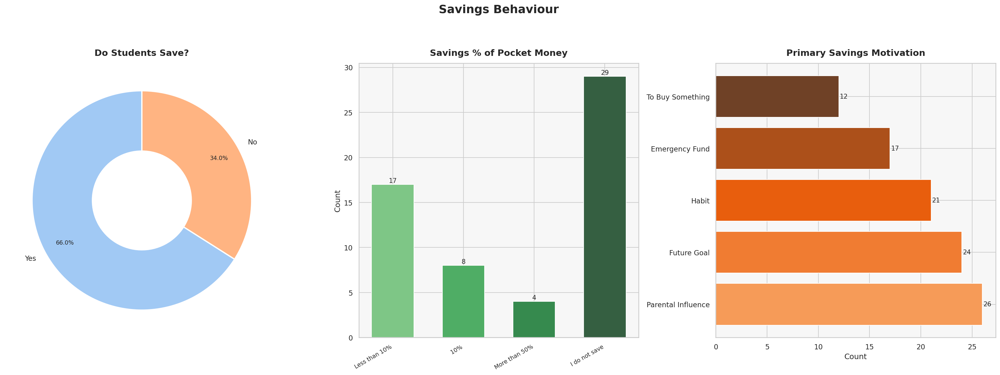

| Saves Money | Count |
|------------|-------|
| Yes, Always | 55 (51%) |
| Sometimes | 45 (42%) |
| No, Never | 7 (7%) |

**Key Insight:** 93% of students save at least sometimes. Despite limited pocket money, the savings intent is high — though consistency varies.

---

### 6️⃣ Influence Factors — Likert Analysis

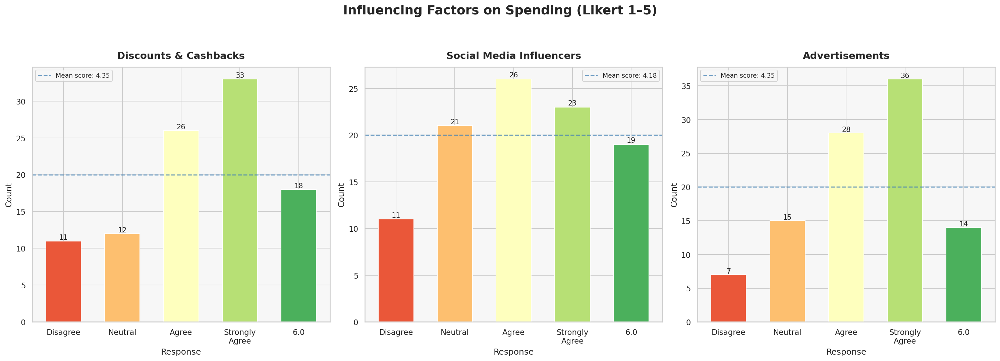

| Influencing Factor | Mean Score (1–5) |
|-------------------|-----------------|
| Discounts / Offers | **3.06** |
| Social Media | 2.63 |
| Advertisements | 2.64 |

**Key Insight:** Discounts have the highest influence on spending decisions. Social media and advertisements have moderate-to-low influence, suggesting students are somewhat resistant to digital marketing.

---

### 7️⃣ Financial Literacy

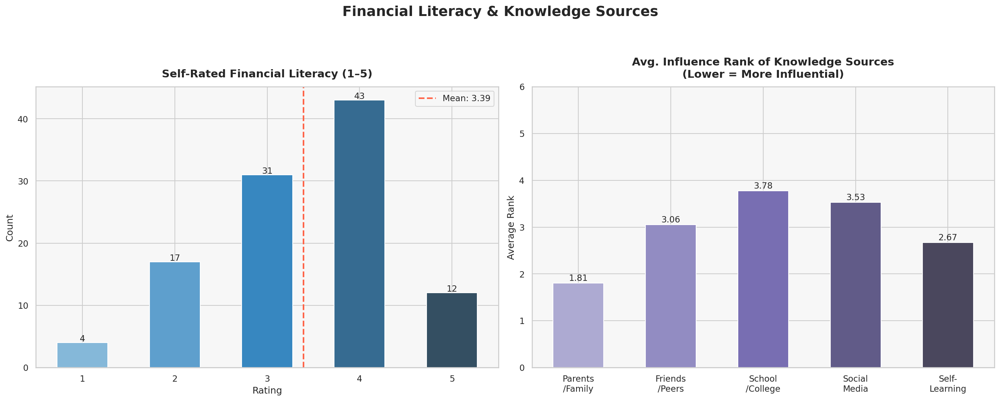

| Metric | Value |
|--------|-------|
| Mean Financial Literacy Rating | **3.39 / 5** |
| Mean Parent Discussion Frequency | **3.17 / 5** |
| Std Dev (Literacy) | 1.01 |
| Std Dev (Parent Discussion) | 1.22 |

**Key Insight:** Students rate their own financial literacy at a moderate 3.39/5, and discuss money management with parents at a similar frequency (3.17/5), indicating room for improvement in financial education.

---

### 8️⃣ Peer Pressure & Budgeting Tools

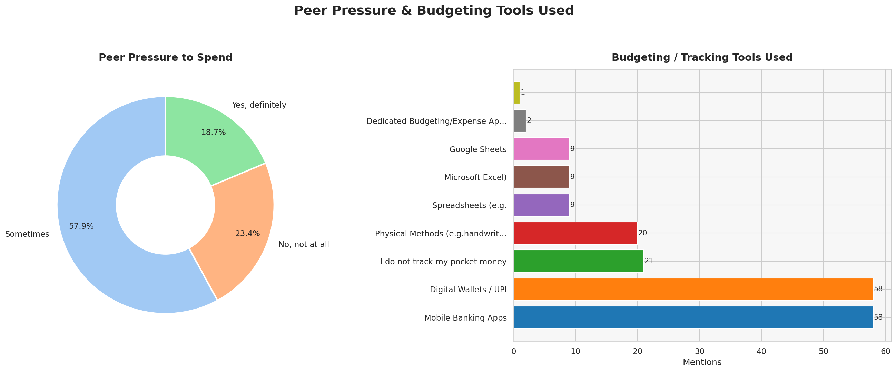

| Peer Pressure | Count |
|--------------|-------|
| Sometimes | 62 (58%) |
| No, not at all | 25 (23%) |
| Yes, definitely | 20 (19%) |

**Top tools used:** Mobile Banking Apps (most common) · Pen & Paper · Mental Note · Spreadsheets

**Key Insight:** 77% of students feel peer spending pressure at least sometimes. Mobile banking apps are the go-to tool for tracking finances, reflecting the digital-first generation.

---

### 9️⃣ Correlation Heatmap

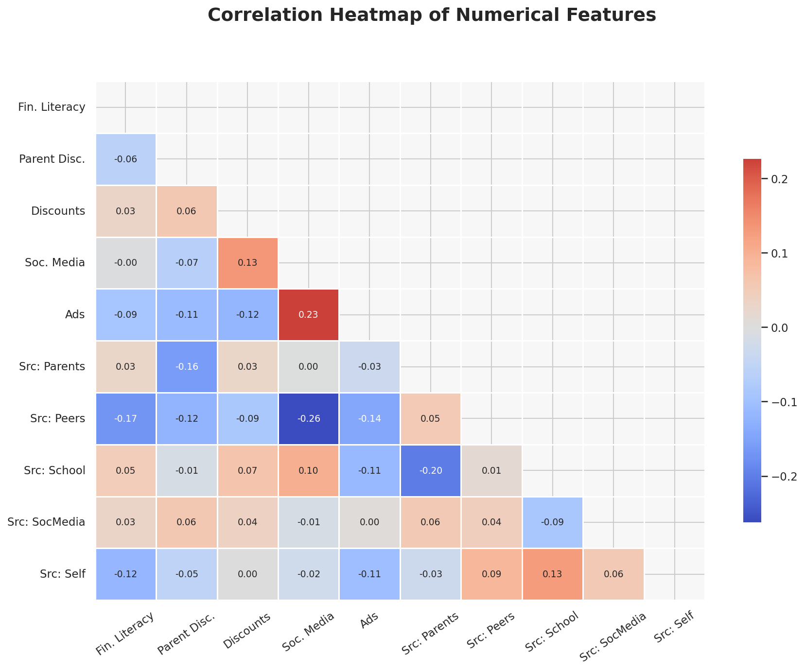

Correlation among numerical features: `Financial_Literacy_Rating`, `Parent_Discussion_Freq`, `Influence_Discounts`, `Influence_SocialMedia`, `Influence_Ads`.

**Key Insight:** Social media influence and advertisement influence show a positive correlation — students susceptible to one tend to be susceptible to the other. Financial literacy shows a mild positive correlation with parent discussion frequency.

---

### 🔟 Cross-Analysis: Savings vs Pocket Money & Run-Out Frequency

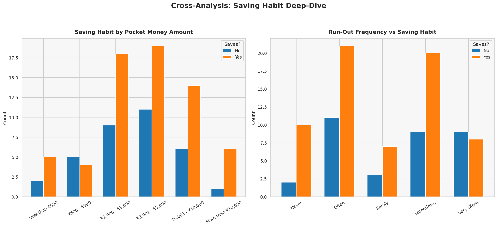

**Key Insight:**  
- Students who **always save** tend to receive higher pocket money amounts — financial cushion enables savings.  
- Students who **never run out** of money are more likely to save consistently.  
- Those who run out **always/very frequently** are predominantly in the "Never" saves category.

---

### 11. Final Dashboard — Pocket Money Management Summary

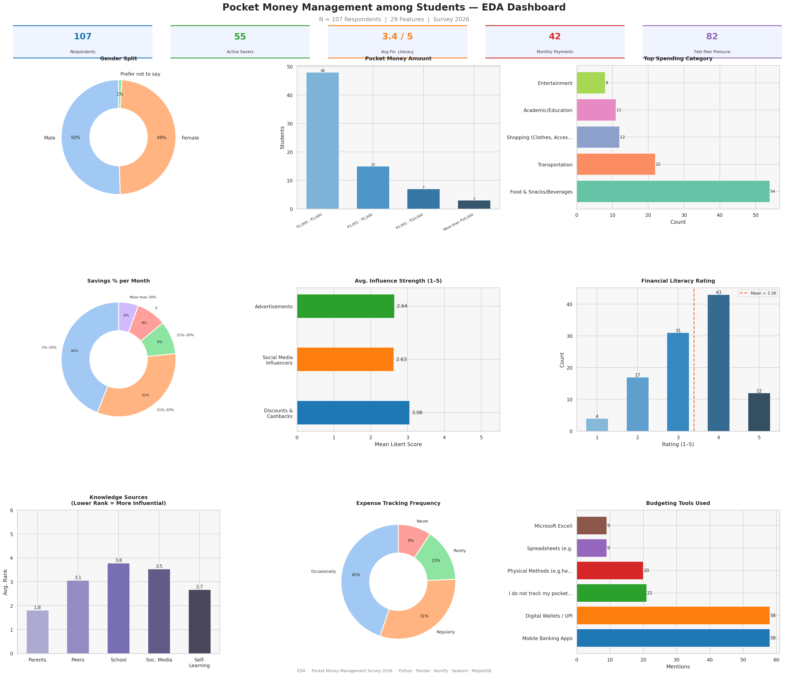

A consolidated summary dashboard covering all major dimensions of the analysis: demographics, spending, savings, tracking, peer pressure, and financial literacy in a single view.

---

## 🔑 Key Takeaways

1. **Most students (77%) receive ₹3,000 or less per month** — a tight budget for a college-going student.
2. **Only 31% track expenses regularly**, yet **68% run out of money** often — highlighting the need for better financial habits.
3. **93% save at least sometimes** — savings intent exists, but consistency needs improvement.
4. **Discounts (3.06/5) influence spending the most** among external factors; social media and ads have moderate impact.
5. **Self-rated financial literacy is 3.39/5** — moderate, with room for structured financial education.
6. **77% feel peer pressure** to spend — a social dynamic that significantly affects student finances.
7. **Mobile Banking Apps** are the most popular budgeting tool among students.

---

## ▶️ How to Run

```bash
# Install dependencies
pip install pandas numpy matplotlib seaborn openpyxl

# Launch the notebook
jupyter notebook main.ipynb
```

Plots are automatically saved to the `output_eda/` folder on execution.
